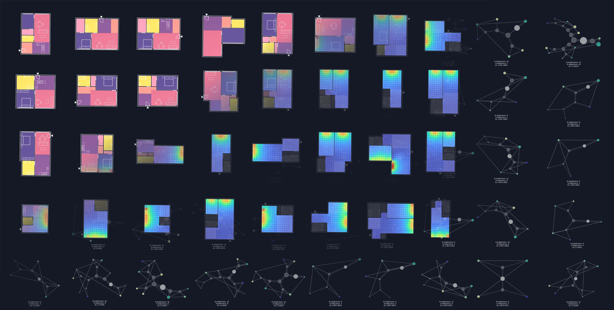
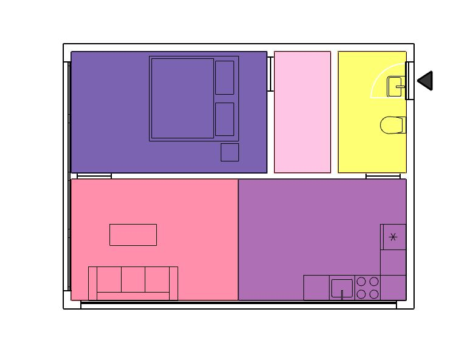
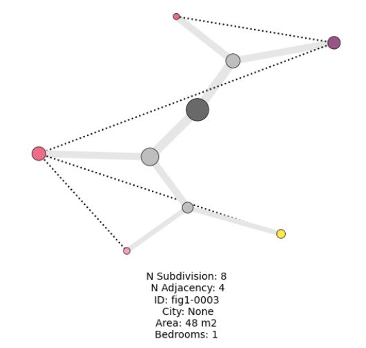

# Hypergraph Research Geometry Library and API

Full source code and documentation of ongoing architectural geometry research on automated floor plan analysis and generation. The repository features a C# source code of the research geometry library, a (mostly) 2d geometry library implementing the hypergraph representation. 
This package is maintained by [@ramonweber](https://github.com/ramonweber) with contributions from [@szvsw](https://github.com/szvsw) for the web api implementation.

The repository is supplementary to the following paper:
[`A hypergraph analysis framework shows carbon reduction potential of effective space use in housing. Ramon Elias Weber, Caitlin Mueller, Christoph Reinhart. Nature Communications, 2024. https://doi.org/10.1038/s41467-024-52506-z`](https://doi.org/10.1038/s41467-024-52506-z)

The paper is available at:

[Open access paper link via Nature Communications](https://www.nature.com/articles/s41467-024-52506-z#citeas)

Contact: ramon@berkeley.edu

An archived repository of this code is available at:

[](https://doi.org/10.1038/s41467-024-52506-z)



*Figure 1: Illustration of the hypergraph representation and environmental analysis of architectural floor plans*

# Contents

- [Introduction](#hypergraph-research-geometry-library-and-api)
- [Overview](#overview)
- [How to use this repository](#how-to-use-this-repository)
- [Requirements](#requirements)
- [Sample files and demos](#sample-files-and-integration-into-cad)
- [Web API](#floorplanner-api)

# Overview

The full research geometry library RGeoLib that implements various geometric algorithms and translates geometry from the CAD package Rhino3d for design automation and analysis of buildings. The geometry library implements data structures for vectors, meshes, lines, hypergraphs, apartments. This repository section gives an overview of the library, the required software packages, as well as the accompanying sample scripts.


# How to use this repository

The repository features 4 different ways to access the files 
1. Full source code for your own experimentation via the `/ResearchGeometryLibrary/RGeoLib`
2. Visualization tools for representing floorplans as hypergraphs `/notebooks/visualize_hypergraph.ipynb`
3. Sample files for integration into the Rhino3d and Grasshopper CAD environment `/samples`
4. API integration of basic FloorPlanner functionality via the web as `/FloorPlanTools`

# Requirements

The package development version is tested on a Windows operating system. While the .Net geometry library, as well as the hypergraph visualizer are platform independent, the sample files require a Windows operating system as well as the following software:

## CAD Environment
- [Rhino3d](https://rhino3d.com/ "rhino") (version 7) 
- [Climate Studio](https://www.solemma.com/climatestudio "cs") (version 2.0.8742.29048) for environmental simulation

## Python Environment
- Python 3.10+ 
- Required packages (see `requirements.txt` and `requirements-dev.txt`):
  - `fastapi`, `uvicorn[standard]`, `pydantic` for API server
  - `pythonnet` for .NET interop
  - `networkx`, `matplotlib`, `plotly` for visualization
  - Jupyter (`ipykernel`, `ipywidgets`) for notebooks

Install Python dependencies with:
```bash
pip install -r requirements.txt          # For API runtime
pip install -r requirements-dev.txt      # For notebooks and development
```

(Installation time ~10min)

# Hypergraph Visualizer (Jupyter Notebooks)

Visualize apartment floor plans as hypergraphs using Jupyter notebooks. A sample JSON file with apartment geometry is included.

## Running the Notebooks

Install notebook dependencies:
```bash
pip install -r requirements-dev.txt
```

### Notebook 1: Visualize Hypergraph
Open `notebooks/visualize_hypergraph.ipynb` to:
- Load and visualize floor plan hypergraphs from JSON
- Create network diagrams of spatial relationships
- Analyze hypergraph properties

Sample data: `notebooks/src/sample_hypergraphs.json`

### Notebook 2: Demo API
Open `notebooks/demo.ipynb` to:
- Test the FastAPI server locally
- Run floor plan fitting algorithms
- Explore the Python API

**Note:** The notebooks automatically handle Python path resolution and DLL loading from the correct locations.

## Visualization Results
<table>
  <tr>
    <td></td>
    <td></td>
  </tr>
  <tr>
    <td align="center">Original architectural floor plan</td>
    <td align="center">Resulting hypergraph from programmatic zones</td>
  </tr>
</table>

# Sample files and demos


## Setup: Running Grasshopper Scripts

The sample Grasshopper (`.gh`) files require the CAD software and properly configured DLLs:

### 1. Copy DLLs to the Grasshopper search path
Copy the entire folder `/samples/_requiredDLLs` to your local hard drive as `C:\geolib\_requiredDLLs`:
```
C:\geolib\_requiredDLLs\  (contains 50+ DLLs including RGeoLib.dll, etc.)
```

### 2. Unblock the DLLs (Windows Security)
Windows blocks DLLs downloaded from the internet. Unblock them in PowerShell:
```powershell
Get-ChildItem "C:\geolib\_requiredDLLs\*.dll" | Unblock-File
```

### 3. Load in Rhino3d and Grasshopper
- Open Rhino3d and load the corresponding `.3dm` file (e.g., `Weber2024 Hypergraph Reference Script 0 Load Hypergraph.3dm`)
- Start Grasshopper (Rhino menu: Grasshopper)
- Open the corresponding `.gh` file with the same name
- The script will automatically load the DLLs from `C:\geolib\_requiredDLLs`

## Sample Scripts Overview

The four sample scripts showcase hypergraph workflows inside Grasshopper:

**Script 0: Load Hypergraph** (`Hypergraph Reference Script 0 Load Hypergraph.3dm`)
- Load and visualize floor plans from a `.json` hypergraph file
- Run time: < 2s at startup


*Sample Script 0: Screenshot from inside the CAD environment Rhino3d and the node based scripting platform Grasshopper where a json file is used to load a floorplan from a hypergraph format.*
(Run time < 2s at startup*)

**Script 1: Transfer Layout via Hypergraph** (`Hypergraph Reference Script 1 Transfer Layout via Hypergraph.3dm`)
- Apply six input floor plans to a target apartment boundary geometry
- Define boundary as a polyline with circulation and façade access lines
- Run time: < 3s at startup, ~0.1s for geometry changes


*Sample Script 1: Floor plan from library applied to target geometry with circulation and façade constraints.*
(Run time < 3s at startup, ~ < 0.1s for geometry change*)

**Script 2: Environmental Simulation** (`Hypergraph Reference Script 2 Environmental Simulation.3dm`)
- Analyze generated floor plans for space, energy use, and daylight
- Run daylight and energy simulations in parallel
- Run time: ~10s per apartment


*Sample Script 2: Floor plan analyzed for space efficiency, energy use, and daylight performance.*
(Run time ~ 10s for environmental simulation including daylight and energy of a single apartment*)

**Script 3: Occupancy Analysis** (`Hypergraph Reference Script 3 Occupancy.3dm`)
- Evaluate spatial usage via furniture blocks
- Test different occupancy patterns
- Run time: ~10s per evaluation


*Sample Script 3: Space evaluation for different furniture configurations and occupancy patterns.*
(Run time ~ 10s for environmental simulation including daylight and energy of a single apartment*)

**Run time measured on Standard Desktop PC (Windows OS, Intel(R) Core(TM) i7-6700k CPY @ 4.00 GHz, 64GB RAM, NVIDIA GeForce GTX 1080) 

# FloorPlanner API


## Web API Server

A FastAPI web server for accessing hypergraph functionality programmatically.

### Installation

```bash
pip install -r requirements.txt
```

### Running the API

```bash
uvicorn api.main:api --reload
```

The API will start at `http://localhost:8000`

Visit `http://localhost:8000/docs` for interactive API documentation (Swagger UI)

### API Endpoints

- `GET /` – Health check
- `GET /apt/{apt_id}` – Get apartment data
- `POST /fit/reference` – Fit floor plan using reference apartments  
- `POST /fit/db` – Fit floor plan from database

## Project Structure

```
hypergraph/
├── api/                        # FastAPI web server
│   ├── main.py               # API endpoints
│   └── lib/tools.py          # RGeoLib wrapper and data models
├── ResearchGeometryLibrary/    # C# geometry library source
│   └── RGeoLib/              # Core library classes
├── notebooks/                  # Jupyter notebooks for analysis
│   ├── visualize_hypergraph.ipynb
│   └── demo.ipynb
├── samples/                    # Rhino3d & Grasshopper sample files
│   ├── *.3dm                 # Rhino files
│   ├── *.gh                  # Grasshopper scripts
│   └── _requiredDLLs/        # .NET assemblies for CAD
├── dlls/                       # (generated at runtime)
│   ├── main/                 # RGeoLib for Python
│   └── reqs/                 # Dependency DLLs for Python
└── requirements*.txt           # Python dependencies
```

## Troubleshooting

### Grasshopper DLL Not Found

**Problem:** Grasshopper scripts fail with "DLL not found" or assembly load errors

**Solution:** Ensure `C:\geolib\_requiredDLLs\` exists with all DLLs from `/samples/_requiredDLLs`, and they are unblocked:
```powershell
Get-ChildItem "C:\geolib\_requiredDLLs\*.dll" | Unblock-File
```

### Python: ModuleNotFoundError: No module named 'RGeoLib'

**Problem:** Notebooks or API fail with RGeoLib import error

**Solution:** Ensure Python dependencies are installed:
```bash
pip install -r requirements.txt
```

The notebook must be run from the project root directory (or it will auto-correct the path)

### API/Python: Assembly Load Errors

**Problem:** "Type X originates from different contexts" or version conflicts

**Solution:** This is typically resolved by the DLL deduplication logic in `api/lib/tools.py`. If issues persist, ensure only one copy of RGeoLib.dll exists (in `C:\geolib\_requiredDLLs\`)

## Consuming the API

### Option 1: Running the API Locally

1. Install docker.
1. Clone the Repo
1. Place all DLLs in the `dlls/lib` or `dlls/reqs` folder.  Make sure they are unblocked.
2. Copy `.env.example` to `.env`
3. Set `API_ROOT_URL` to `http://localhost:8000`
3. Run `docker compose up` from the repository root
4. Open the notebook `notebooks/demo.ipynb`
5. Run all.

### Option 2: Using the Deployed API

1. Clone the Repo
1. Make a conda env: `conda create -n floorplans python=3.9`
1. Install reqs: `pip install -r requirements.txt -r requirements-dev.txt`
2. Copy `.env.example` to `.env`
3. Update the value for `API_ROOT_URL` to the web URL (inquire for details)
4. Open the notebook `notebooks/demo.ipynb`
5. Run all.


## Dev Setup

### Option 1: Local Environment

#### Setup

Create a conda environment:

```
conda create -n floorplan python=3.9`
```

Then install dependencies:

```
pip install -r requirements.txt -r requirements-dev.txt
```

#### Run the API

To run the API, launch the following command from a terminal in the root directory of the repository:

```
uvicorn api.main:api
```

You can optionally append `--reload` to enable hot-reloading as you edit the backend.

Then, visit `http://localhost:8000` in your browser.  You should see `{"message": "Hello world!"}` appear.

Next, visit `http://localhost:8000/docs` to see the auto-documentation page and a list of the various endpoints.  

### Option 2: Docker Compose

Install docker.

Then, from the root of the repo, run `docker compose up`.

Then visit `http://localhost:8000/docs` in a browser to see the autodocs page.


